# The Sublime-less Zettelkasten

This is a note taking app that enables clickable ID-based Wiki-style links, and #tags in your plain text (Markdown) documents.

If you follow the (plain-text) Zettelkasten method (as proposed by [Zettelkasten.de](https://zettelkasten.de) or [takesmartnotes.com](http://takesmartnotes.com/#moreinfo)), this might appeal to you.

In short, it helps you manage an archive of interlinked notes that look like this:

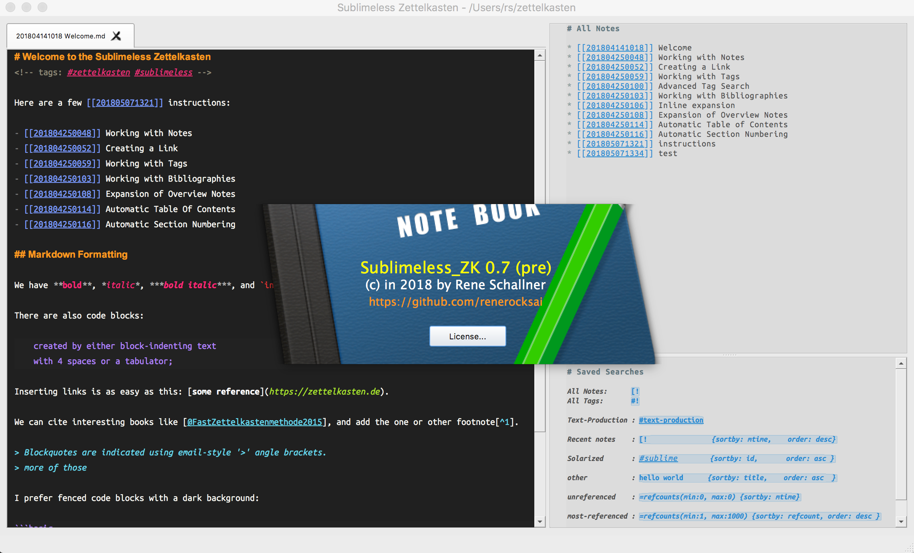

In addition to being a specialized Markdown text-editor and text-browser, Sublimeless_ZK is loaded with features for text-production:

* sophisticated search methods for finding associated notes that
    * reference the same #tag combination
    * or cite a certain source
    * or are linking to a certain note
* expanding notes containing links to other notes (overview notes) into notes notes containing the linked notes' contents
    * can be refreshed if source notes change
    * refresh can be enabled / disabled on a per contained note basis
* parameterized templates for new notes
* easy insertion of links, #tags, and citation-keys via fuzzy-search
* auto-insertion (and removal) of section numbers
* auto-insertion of tables of contents
* auto-insertion of bibliographies
* export to stand-alone semantic text view HTML

See the [Usage](#usage) section below to see how this package might support your workflow.

Alternatively, watch it in action :smile:


This app is the result of trying to make a stand-alone version of [sublime_zk](https://github.com/renerocksai/sublime_zk), the SublimeText Zettelkasten package.

## Main Features
*(This app is still in active development. If you like, stay up to date with latest developments at: [Its dedicated Zettelkasten.de Forum Thread](https://forum.zettelkasten.de/discussion/226/renes-sublimeless-zettelkasten#latest))*

* Place wiki style links like `[[this]]` or `[this]` into your notes to link to other notes in your note archive.
* Clicking such a link will open the corresponding note in a new tab.
* Pressing <kbd>alt</kbd> and clicking a link will search for all notes also referencing the linked note [('friend notes')](#searching-for-friends).
* Typing `[[` will open a list of existing notes so you can quickly link to existing notes.
* <kbd>[shift]</kbd>+<kbd>[enter]</kbd> lets you enter a name for a new note. The new note is then created with a new note ID.
* Implicit note creation by clicking links to non-existing notes' titles, see [below](#implicitly-creating-a-new-note-via-a-link).
* The ID format is timestamp-based YYYYMMDDHHMM - eg: 201710282111, but can be switched second-precision YYYYMMDDHHMMSS - eg: 20171224183045
* Highlighting of #tags and @citekeys.
* Typing `#!` will display all your **#tags**, sorted, in the search results area
* `#?` opens up a list of all your **#tags** and lets you fuzzy search and select them (like note-links).
* Clicking a **#tag** or @citekey will search for all notes containing this tag / citekey.
* [Expansion of overview notes with selective refresh](#expansion-of-overview-notes-with-selective-refresh)!!!
* [Templates for new notes](#new-note-templates)
* [Optional](#insert-links-with-or-without-titles) insertion of `[[links]] WITH note titles` instead of just `[[links]]`
* Inline expansion of [note links](#inline-expansion-of-note-links), [tags](#inline-expansion-of-tags), and [citekeys](#inline-expansion-of-citekeys) via <kbd>ctrl</kbd>+<kbd>.</kbd>
* [Searching for advanced tag combinations](#advanced-tag-search)
* [Find in files](#find-in-files)
* [Automatic Bibliographies](#automatic-bibliographies),  and fuzzy-search [insertion of citations](#inserting-a-citation)
* [Automatic Table Of Contents](#automatic-table-of-contents)
* [Automatic Section Numbering](#automatic-section-numbering)
* [Color Schemes](#color-schemes)
* [Saved Searches](#saved-searches)
* [HTML Export into a semantic text view](#html-export)
* [Command Palette](#command-palette)


## Contents

* [Installation](#installation)
    * [Windows](#windows)
    * [macOS](#macos)
    * [Linux](#linux)
    * [Installing Pandoc](#installing-pandoc)
    * [Installing the Ubuntu Mono Font](#installing-the-ubuntu-mono-font)

* [Configuration](#configuration)
    * [Files](#files)
        * [The settings file](#the-settings-file)
        * [Markdown filename extension](#markdown-filename-extension)
        * [Auto-Save Interval](#auto-save-interval)
    * [Notes and Links](#notes-and-links)
        * [Single or double brackets](#single-or-double-brackets)
        * [Note ID precision](#note-id-precision)
        * [Insert links with or without titles](#insert-links-with-or-without-titles)
        * [IDs in titles of new notes](#ids-in-titles-of-new-notes)
        * [New Note templates](#new-note-templates)
    * [Color Schemes](#color-schemes)
        * [Monokai Color Scheme](#monokai-color-scheme)
        * [Solarized Color Scheme](#solarized-color-scheme)
    * [Bibliographies and Citations](#bibliographies-and-citations)
        * [Location of your .bib file](#location-of-your-bib-file)
        * [Citation Reference Style](#citation-reference-style)

* [Usage](#usage)
    * [Shortcut cheatsheet](#shortcut-cheatsheet)
    * [User Interface](#user-interface)
        * [Menus](#menus)
        * [Command Palette](#command-palette)
        * [Status Bar](#status-bar)
    * [Note Archive Folder](#note-archive-folder)
    * [Creating a new note](#creating-a-new-note)
    * [Creating a new note and link from selected text](#creating-a-new-note-and-link-from-selected-text)
    * [Creating a link](#creating-a-link)
        * [Implicitly creating a new note via a link](#implicitly-creating-a-new-note-via-a-link)
        * [Supported link styles](#supported-link-styles)
    * [Searching for friends](#searching-for-friends)
    * [Listing all notes](#listing-all-notes)
    * [Browsing through notes](#browsing-through-notes)
    * [Find in files](#find-in-files)
    * [Working with tags](#working-with-tags)
        * [Getting an overview of all your tags](#getting-an-overview-of-all-your-tags)
        * [Inserting tags](#inserting-tags)
        * [Searching for notes containing specific tags](#searching-for-notes-containing-specific-tags)
        * [Advanced Tag Search](#advanced-tag-search)
            * [Grammar and Syntax](#grammar-and-syntax)
            * [Putting it all together](#putting-it-all-together)
    * [Expansion of overview notes with selective refresh](#expansion-of-overview-notes-with-selective-refresh)
        * [Expansion of overview notes](#expansion-of-overview-notes)
        * [Refreshing an expanded overview note](#refreshing-an-expanded-overview-note)
        * [Inline expansion of note-links](#inline-expansion-of-note-links)
    * [Working with Bibliographies](#working-with-bibliographies)
        * [Inserting a citation](#inserting-a-citation)
        * [Auto-Completion for citekeys](#auto-completion-for-citekeys)
        * [Automatic Bibliographies](#automatic-bibliographies)
        * [Searching for notes referencing a specific citekey](#searching-for-notes-referencing-a-specific-citekey)
    * [Section Numbering and Table Of Contents](#section-numbering-and-table-of-contents)
        * [Automatic Table Of Contents](#automatic-table-of-contents)
        * [Automatic Section Numbering](#automatic-section-numbering)
    * [Saved Searches](#saved-searches)
    * [HTML Export](#html-export)
    * [Customizing Themes](#customizing-themes)
        * [Creating a new Theme](#creating-a-new-theme)
        * [Editing Themes](#editing-themes)
        * [Switching Themes](#switching-themes)
* [Credits](#credits)


## Installation

There are no installers. Just download and enjoy.

The [releases](https://github.com/renerocksai/sublimeless_zk/releases) section of the GitHub repository provides binary [downloads](https://github.com/renerocksai/sublimeless_zk/releases) for up-to-date versions of both Windows 10 (64bit) and macOs.

### Windows

* Download the Windows ZIP (`sublimeless_zk-pre-x.y-win10.zip`) [from the GitHub release archive](https://github.com/renerocksai/sublimeless_zk/releases)
* Unzip `sublimeless_zk-pre-x.y-win10.zip`
* In the resulting `sublimeless_zk-pre-x.y-win10` folder, `sublimeless_zk.exe` is the program you want to run.


**Note:** On many systems, the extension `.exe` is not shown.


### macOS
* Download the macOS ZIP (`sublimeless_zk-pre-x.y-macOS.zip`) [from the GitHub release archive](https://github.com/renerocksai/sublimeless_zk/releases)
* Unzip `sublimeless_zk-pre-x.y-macOS.zip`
* In the resulting `sublimeless_zk-pre-x.y-macOS` folder, `sublimeless_zk-pre-x.y.app` is the program you want to run.

### Linux

* Download the Linux `.tar.gz` (`sublimeless_zk-pre-x.y-linux.tar.gz`) [from the GitHub release archive](https://github.com/renerocksai/sublimeless_zk/releases)
* Unpack `sublimeless_zk-pre-x.y-linux.tar.gz`
* In the resulting `sublimeless_zk-pre-x.y-linux` folder, `sublimeless_zk` is the program you want to run.

#### Alternative Linux Installation

If the above method doesn't work, you can try running the sources directly

* Install python 3.6 (eg, from [Anaconda](https://continuum.py))
* Install required packates: `pip3 install pyqt5 qscintilla jstyleson fuzzyfinder pymmd markdown pypandoc pygments bibtexparser`
    * build the Multimarkdown shared library for pymmd (required for HTML export): `python3 -c "import pymmd; pymmd.build_mmd()"`
    * for that to work you need a working C compiler and cmake:
        * `sudo apt-get install cmake gcc binutils`
* Download or `git clone` the sources directly from [GitHub](https://github.com/renerocksai/sublimeless_zk)
* change into the `src` folder
* run `python3 sublimeless_zk.py`


### Installing Pandoc

Whether you use [Pandoc](https://pandoc.org) or not for Markdown processing, the [AutoBib](#automatic-bibliographies) feature requires it. Luckily it is [easy to install](https://pandoc.org/installing.html).


### Installing the Ubuntu Mono Font

If you want the best aesthetics, [download](https://assets.ubuntu.com/v1/fad7939b-ubuntu-font-family-0.83.zip) the [Ubuntu Mono](https://design.ubuntu.com/font/) fonts and install the following 4 by double-clicking them:

* `UbuntuMono-R.ttf`
* `UbuntuMono-RI.ttf`
* `UbuntuMono-B.ttf`
* `UbuntuMono-BI.ttf`


## Configuration

### Files

#### The Settings File
You can edit all settings by opening the settings file:

* Windows: Use the menu: Edit > Settings
* macOS:
    * press <kbd>Command</kbd> + <kbd>,</kbd>
    * alternatively use the menu: sublimeless_zk > Preferences...

**Note:** You need to save the settings after you changed them.

**Note:** Some changes only take effect after restarting the app: color scheme, for instance.


The settings file is just a text file an can be edited like any other text file. Here is an excerpt from the default settings:

**Note:** All lines starting with `//` are just comments.

```
{
    // Theme:
    //    themes/monokai.json
    //    themes/solarized_light.json
    "theme": "themes/monokai.json",

    // The preferred markdown extension
    "markdown_extension": ".md",
```

We will go into further details later, but here is a quick reference of all currently supported settings:

| setting | default | remarks |
|---------|---------|---------|
"theme" | "themes/monokai.json" | Theme for the note editor. Alternative theme: "themes/solarized_light.json" |
"markdown_extension" | ".md" | Extension of your note files. |
"new_note_template" | `"---\nnote-id: {id}\ntitle: {title}\nauthor: My Self\ndate: {timestamp: %Y-%m-%d}\n---\n<!-- tags: -->"` | Template for new notes. Fields in `{curly braces}` will be substituted.|
"double_brackets" | true | Insert links with [[double brackets]] (true) or [single brackets] (false)|
"insert_links_with_titles" | false | insert note title after inserted link |
"id_in_title" | false | New notes title will contain the note id (true) or not (false) |
"tag_prefix" | "#" | Prefix character(s) for tags. |
"path_to_pandoc" | "/usr/local/bin/pandoc" | Explicit location of the pandoc program. Only needed for auto-bib, and if pandoc can't be found automatically.|
"bibfile" | "/path/to/zotero.bib" | bibliography file to use if none is contained in the notes folder |
"convert_bibtex_to_unicode" | true | convert bibtex strings to unicode for showing umlauts etc. **Set this to false if loading your .bib file takes ages**
"toc_suffix_separator" | "_" | suffix separator for distinguishing links to identically named sections in table of contents. If you plan to use pandoc for HTML conversion, set this to "-" |
"citations-mmd-style" | false | `[@citekey]` pandoc notation (false) or `[][#citekey]` multimarkdown notation for inserted citations |
"seconds_in_id" | false | Long YYYYMMDDHHMMSS timestamp IDs containing seconds (true) or default YYYYMMDDHHMM IDs (false) |
"sort_notelists_by" | "id" | in search-results, search by note "id" or note "title" |
"auto_save_interval" | 60 | auto-save unsaved notes every n seconds. 0 to disable |
"skip_first_heading_when_numbering" | false | exclude first heading when auto-numbering sections 
"wrap_lines" | true | wrap lines or rather scroll horizontally
"show_wrap_markers" | true | show markers at the end of wrapping lines
"indent_wrapped_lines" | false | should wrapping lines be indented even further
"auto_indent" | true | automatically indent next line when pressing return
"show_indentation_guides" | true | show guides for indented lines
"use_tabs" | false | use tabs instead of 4 spaces when pressing the <kbd>TAB</kbd> key


#### Markdown filename extension
By default, the extension `.md` is used for your notes. If that does not match your style, you can change it with the `markdown_extension` setting. Just replace `.md` with `.txt` or `.mdown` or whatever you like.

#### Auto-Save Interval

The setting `auto_save_interval` specifies the interval in seconds, at which unsaved notes will be saved automatically. Set this to `0` to disable auto-save.

### Notes and Links

#### Single or double brackets
Whether you want to use `[[this link style]]` or `[that link style]` is totally up to you. Both work. But you need to configure which style you prefer, so automatically inserted links will match your style. `[[double bracket]]` links are the default, and if you want to change that to single bracket links, set the `double_brackets` parameter to `false` in the settings file.

#### Note ID precision

The default note ID format is a timestamp in `YYYYMMDDHHMM` format, with minute precision. If you tend to create more than one note per minute, this can be a problem. In that case, you can change the note ID format to `YYYYMMDDHHMMSS`, with second-precision.

The following setting influences the note ID format:

```
    // seconds in note IDs?
    // if true : YYYYMMDDHHMMSS 20171224183045
    // if false: YYYYMMDDHHMM   201712241830
    "seconds_in_id": true,
```

#### Insert links with or without titles
There are numerous times where the app inserts a `[[link]]` to a note into your text on your behalf. You may not only choose the single or double-bracketness of the links, you may also choose whether the **note title** should follow the inserted link.

The setting `"insert_links_with_titles"` takes care of that and is set to `false` by default:

```
// links like "[[199901012359]] and note title" instead of "[[199901012359]]"
"insert_links_with_titles": false,
```

Examples how inserted links might look like depending on this setting:

```markdown
`insert_links_with_titles` is `true`:
[[199901012359]] and note title


`insert_links_with_titles` is `false`:
[[199901012359]]
```

#### IDs in titles of new notes

When you create a new note, its title will automatically be inserted and an ID will be assigned to it (see [Creating a new note](#creating-a-new-note)). If you want the ID to be part of the title, change the setting `id_in_title` from `false` to `true`.

Example for a note created with ID:

```markdown
# 201710310128 This is a note with its ID in the title
tags=

The setting id_in_title is set to true.
```

Example for a note created without ID:

```markdown
# A note without an ID
tags =

The setting id_in_title is set to false.
```

#### New Note templates

If you need further customizing of how your new notes should look like, you can define your own template:

In the settings just edit the `new_note_template` like this:

```
  "new_note_template": "---\nuid: {id}\ntags: \n---\n",
```

To produce new notes like this:

```
---
uid: 201711150402
tags:
---
```

The format string works like this:

* `\n` creates a new line.
* `{id}` : the note id like `201712241830`
* `{title}` : note title like `Why we should celebrate Christmas`
* `{origin_id}` : the id of the note you came from when creating a new note
* `{origin_title}` : the title of the note you came from when creating a new note
* `{file}` : the filename of the note like `201712241830 Why we should celebrate Christmas.md`
* `{path}` : the path of the note like `/home/reschal/Dropbox/Zettelkasten`
* `{timestamp: format-string}`: the date timestamp formatted by _format-string_, see [below]

`origin` might need a bit of explanation: When you are in note `201701010101` and create a new note via `[shift]+[enter]` or via `[[implicit note creation via title]]`, the new note will get a new id, maybe `201702020202`. Its `{id}` therefore will be `201702020202` and its `{origin}` will be `201701010101`.

#### Date and time formatting options for timestamp

| Directive | Meaning | Example |
|-----------|---------|---------|
|`%a`|Weekday as locale’s abbreviated name.|Sun, Mon, …, Sat (en_US); So, Mo, …, Sa (de_DE)|
|`%A`|Weekday as locale’s full name.|Sunday, Monday, …, Saturday (en_US); Sonntag, Montag, …, Samstag (de_DE)|
|`%d`|Day of the month as a zero-padded decimal number.|01, 02, …, 31 |
|`%b`|Month as locale’s abbreviated name. | Jan, Feb, …, Dec (en_US); Jan, Feb, …, Dez (de_DE) |
|`%B`|Month as locale’s full name. | January, February, …, December (en_US); Januar, Februar, …, Dezember (de_DE) |
|`%m`|Month as a zero-padded decimal number.|01, 02, …, 12 |
|`%y`|Year without century as a zero-padded decimal number.|00, 01, …, 99|
|`%Y`|Year with century as a decimal number.|2017, 2018, …|
|`%H`|Hour (24-hour clock) as a zero-padded decimal number.|00, 01, …, 23|
|`%I`|Hour (12-hour clock) as a zero-padded decimal number.|00, 01, …, 12|
|`%p`|Locale’s equivalent of either AM or PM.|AM, PM (en_US); am, pm (de_DE)|
|`%M`|Minute as a zero-padded decimal number.|01, 02, …, 59 |
|`%S`|Second as a zero-padded decimal number.|01, 02, …, 59 |
|`%j`|Day of the year as a zero-padded decimal number.|001, 002, …, 366|
|`%U`|Week number of the year (Sunday as the first day of the week) as a zero padded decimal number. All days in a new year preceding the first Sunday are considered to be in week 0.|00, 01, …, 53|
|`%W`|Week number of the year (Monday as the first day of the week) as a zero padded decimal number. All days in a new year preceding the first Monday are considered to be in week 0.|00, 01, …, 53|
|`%c`|Locale’s appropriate date and time representation.|Tue Aug 16 21:30:00 1988 (en_US); Di 16 Aug 21:30:00 1988 (de_DE)|
|`%c`|Locale’s appropriate date representation.|08/16/88 (None); 08/16/1988 (en_US); 16.08.1988 (de_DE)|
|`%%`|A literal `%` character.|%|

##### Examples for note id **201802261632**:

* `{timestamp: %Y-%m-%d %H:%M}`: _2018-02-26 16:32_
* `{timestamp: %a, %b %d, %Y}`: _Mon, Feb 26, 2018_

##### Example YAML note header

To produce a YAML note header (for pandoc), like this:

```yaml
---
note-id: 201802270019
title:  Date Test
author: First Last
date: 2018-02-27
tags:
---
```

you can use the following settings:

```
// when creating a new note, put id into title?
 // false to disable
"id_in_title": false,

// Template for new notes
"new_note_template":
    "---\nnote-id: {id}\ntitle: {title}\nauthor: First Last\ndate: {timestamp: %Y-%m-%d}\ntags: \n---\n",
```

### Color Schemes

Two color schemes are provided by default. The sections below describe how you activate them in the settings file.

You can also use the View > Switch Theme... menu to select a different theme.

You can read more on defining your own themes in [Customizing Themes](#customizing-themes).

#### Monokai Color Scheme


on Windows


This theme is active per default, in the settings file:

```
    // Theme:
    //    themes/monokai.json
    //    themes/solarized_light.json
    "theme": "themes/monokai.json",
```

#### Solarized Color Scheme

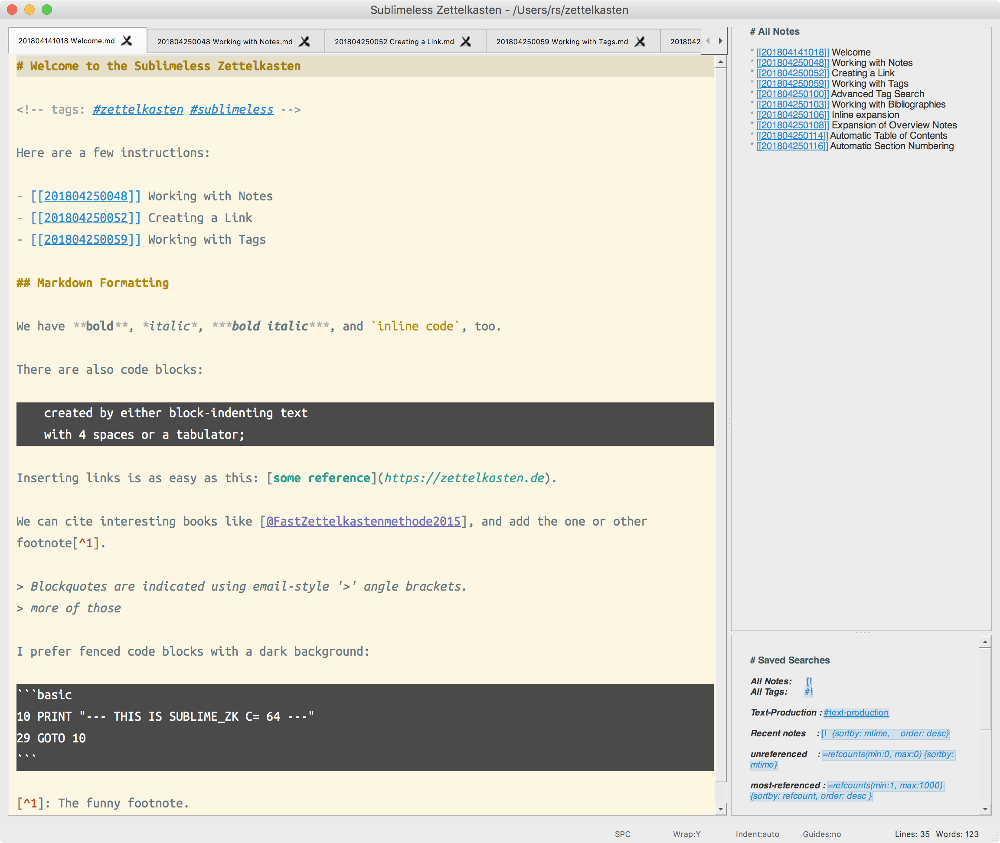

This theme is activated like this in the settings file:

```
    // Theme:
    //    themes/monokai.json
    //    themes/solarized_light.json
    "theme": "themes/solarized_light.json",
```

**Note:** For a theme change to take effect, you need to re-start the app.

### Bibliographies and Citations

#### Location of your .bib file
If you [work with bibliographies](#working-with-bibliographies), this app can make use of your `.bib` files to enable insertion of `@citekeys` (or `#citekeys` if you use MultiMarkdown) and [automatic creation of bibliographies](#automatic-bibliographies) inside of your notes.

**Note:** If a `.bib` file resides in your note archive folder then the app will find it automatically. No configuration needed!

**Hint:** If you happen to work with multiple note archives, each requiring its own `.bib` file, it makes sense to make the `.bib` files part of their corresponding note archives.

However, if you maintain your `.bib` file outside of your note archive, then you can configure its location in the settings; just add a line like this:

```
    "bibfile": "/path/to/zotero.bib",
```

In cases where both a bibfile setting is present *and* an actual `.bib` file is found in your note archive, the one in the note archive will be used.

**Note** 

* Your `.bib` file is loaded the first time you insert a citation
* Strings in the `.bib` file are being converted to unicode so umlauts and special characters can be displayed in the fuzzy panel
* This conversion can take long
* To disable the conversion and live with `u` instead of `ü`, set the setting `"convert_bibtex_to_unicode"` to `false`.
* To re-load your `.bib` file, use the menu Tools > Reload BIB file or press <kbd>ctrl/cmd</kbd> + <kbd>shift</kbd> + <kbd>B</kbd>

#### Citation Reference Style

Two major ways to handle citations in Markdown documents exist: Pandoc and MultiMarkdown. Which one you use, depends on your preferred tool-chain.

**Note:** Pandoc style is the default, see below how to change this.

Example for pandoc:

```markdown
Reference to some awesome article [@awesome2017].

<!-- bibliography
[@awesome2017]: Mr. Awesome. 2017. _On Being Awesome_
-->
```

Example for MultiMarkdown:

```markdown
Reference to some awesome article [][#awesome2017].

<!-- bibliography -->
[#awesome2017]: Mr. Awesome. 2017. _On Being Awesome_

```

The following line in the settings turns MultiMarkdown mode on:

```
"citations-mmd-style": true,
```


## Usage

### Shortcut cheatsheet

* [Command Palette](#command-palette) <kbd>ctrl/cmd</kbd> + <kbd>shift</kbd> + <kbd>P</kbd>
* [Create a new note](#creating-a-new-note) <kbd>shift</kbd> + <kbd>enter</kbd>
* [New note from text](#creating-a-new-note-and-link-from-selected-text) Select text, then <kbd>shift</kbd> + <kbd>enter</kbd>
* [New note from text link](#implicitly-creating-a-new-note-via-a-link) : Click [the text link]
* [Fuzzy search and open note](#browsing-through-notes)  <kbd>ctrl/cmd</kbd> + <kbd>P</kbd>
* [Find in files](#find-in-files) <kbd>ctrl/cmd</kbd> + <kbd>shift</kbd> + <kbd>F</kbd>
* [Open link with keyboard](#creating-a-link) Cursor in link, then <kbd>ctrl</kbd> + <kbd>enter</kbd>
* Cycle tabs  <kbd>ctrl/cmd</kbd> + <kbd>shift</kbd> + <kbd>[</kbd> (left) and <kbd>ctrl/cmd</kbd> + <kbd>shift</kbd> + <kbd>]</kbd> (right)
* [Insert link](#creating-a-link) <kbd>[</kbd> + <kbd>[</kbd>
* [Find referencing (friend) notes](#searching-for-friends) <kbd>ALT</kbd> + click link to note
* [View all tags](#getting-an-overview-of-all-your-tags) <kbd>#</kbd> + <kbd>!</kbd>
* [View all notes](#listing-all-notes) <kbd>[</kbd> + <kbd>!</kbd>
* [Insert tag](#inserting-tags) <kbd>#</kbd> + <kbd>?</kbd>
* [Find tag references](#searching-for-notes-containing-specific-tags): Just click a #tag
* [Expand link inline](#inline-expansion-of-note-links) <kbd>ctrl</kbd> + <kbd>.</kbd>
* [Expand tag inline](#inline-expansion-of-tags) (with referencing notes) <kbd>ctrl</kbd> + <kbd>.</kbd>
* [Expand citekey inline](#inline-expansion-of-citekeys) (with referencing notes) <kbd>ctrl</kbd> + <kbd>.</kbd>
* [Insert multimarkdown citation](#inserting-a-citation) <kbd>[</kbd> + <kbd>#</kbd> (needs `"citations-mmd-style": true`)
* [Insert pandoc citation](#inserting-a-citation) <kbd>[</kbd> + <kbd>@</kbd> (needs `"citations-mmd-style": false`)

### User Interface
As you can see in the various screenshots, the user interface is split into three areas; they are:

* left: note editor tabs
* right: side-panel
    * top right: search results area
        * will display results of various implicit or explicit searches you perform
    * bottom right: [saved searches](#saved-searches) area
* bottom: status bar

#### Menus

There are keyboard shortcuts for almost everything, but sometimes it is just handy to browse through the menus.

Let's introduce them!

* sublimeless_zk (only on macOS)
    * About sublimeless_zk : Show about dialog
    * Preferences... : Opens the settings file for editing.

* File
    * New Zettel Note : create a new note
    * Open Notes Folder : switch to another note folder
    * Save : save the current file (note or settings or saved searches)
    * Save All : save all files
    * Browse notes to open : fuzzy-search through notes, select to open
    * Rename note... : rename the current note
    * Delete note... : delete the current note
    * Export archive to HTML... : [HTML Export](#html-export)
    * 1: most recent notes folder : opens it
    * 2: second most recent notes folder : opens it
    * ...
    * 9: ninth most recent notes folder : opens it

* Edit
    * Undo : undo last action in current editor
    * Redo : redo last action in current editor
    * Copy : copy selected text to clipboard
    * Cut : cut selected text to clipboard
    * Paste : paste clipboard into current editor
    * Editor:
        * Toggle Auto-Indent : auto-indent on/off
        * Toggle Line Wrap : line wrap on/off
        * Toggle Wrap Markers: show / hide markers at the end of wrapping lines
        * Toggle Wrap Indent: indent wrapped lines even further
        * Toggle Indentation Guides: show hide guides for indented lines
        * Toggle TAB / Spaces : toggle <kbd>TAB</kbd> inserts TAB or spaces
    * Insert Link to Note : insert a link via fuzzy search panel
    * Insert Tag : insert a tag via fuzzy search panel
    * Expand Link : expand a link / tag / citekey inline in the line below
    * Insert Citation : insert a citation key via fuzzy search panel
    * Insert Bibliography : insert bibliography of all cited sources in current note
    * Insert Table of Contents : insert a table of contents into current note
    * Insert Section Numbers : prefix headings with section numbers
    * Remove Section Numbers : remove section numbers from headings if present
    * Settings... (Windows only) : Opens the settings file for editing

* Search
    * Find/replace... : show search and (optionally) replace dialog to find/replaace text in current editor
    * Find in files : search for text in all notes
    * Search for Tag Combination : Advanced Tag Search

* View
    * Show Command Palette... : does exactly that
    * Cycle forwards through tabs: open next tab
    * Cycle backwards through tabs: open previous tab
    * Toggle Side Panel : Show / hide the side panel
    * Toggle Status Bar : Show / hide the status bar
    * Show all notes : shows all notes in the search results
    * Show all referencing notes : If cursor is in a link / tag / citation key, search for all notes with the same reference (link/tag/citekey)
    * Show all Tags: shows a tag list in the search results
    * New Theme... : Create a new theme 
    * Switch Theme... : Switch to a different theme
    * Edit Theme... : edit the current theme
    * Full Screen (macOS only) : go full screen

* Tools
    * Reload BIB file : Do this when your `.bib` file has changed
    * Expand Overview Note : create new note from current one where all links are replaced by contents
    * Refresh expanded Note: Refresh such an expanded note if sources have changed

* About (Windows only) : Shows the about dialog

#### Command Palette

As alternative to the menus, you can also use the command palette, triggered by pressing <kbd>ctrl/cmd</kbd> + <kbd>shift</kbd> + <kbd>P</kbd>.

You can fuzzy-search for any menu command there and select it by pressing <kbd>return</kbd> or double-clicking it.

The following animation shows the command palette in action:


#### Side Panel

The side-panel shows the current search results at the top for you to click and your [saved searches](#saved-searches) at the bottom.

**Note:** You can show and hide the side panel with View > Toggle Side Panel or <kbd>ctrl/cmd</kbd> + <kbd>shift</kbd> + <kbd>J</kbd>.

#### Status Bar

The status bar at the bottom shows the following information:
* line count of the current note
* word cound of the current note
* editor status information


The above image shows:

* 38 lines in the current note
* 130 words in the current note
* line wrap is on (Y)
* line wrapping markers are shown (+show)
* wrapped lines are indented (+indent)
* auto-indent is on (auto)
* indentation guides are shown (yes)

**Note:** You can show and hide the status bar with View > Toggle Status Bar or <kbd>ctrl/cmd</kbd> + <kbd>shift</kbd> + <kbd>J</kbd>.

### Note Archive Folder

When you first start the app, it creates a `zettelkasten` folder in your home / user directory. On Windows, this is typically `C:\Users\your.username\zettelkasten`, on macOS it is typically `/Users/your.username/zettelkasten`, and on Linux it usually is `/home/your.username/zettelkasten`.

This `zettelkasten` folder comes with one or more default notes to get you started.

If you have an existing note archive already, you can switch to it with <kbd>ctrl/cmd</kbd>+<kbd>O</kbd>, or use the File > Open... menu.

The app keeps track of up to 10 recently opened note archive folders, which are accessible at the bottom of the File menu.


### Creating a new note

* Press `[shift]+[enter]`. This will prompt you for the title of the new note.
* Press `[ESC]` to cancel without creating a new note.
* Enter the note title and press `[enter]`.

A new note will be created and assigned the timestamp based ID in the format described above.

Example: Let's say you entered "AI is going to kill us all" as the note title, then a file with the name `201710282118 AI is going to kill us all.md` will be created and opened for you.

The new note will look like this:

```markdown
# AI is going to kill us all
tags =
.
```

### Creating a new note and link from selected text

There is a very convenient shortcut to create notes from selected text and automatically inserting a link to the new note, replacing the selected text: Just select the text you want to use as note title before pressing `[shift]+[enter]`.

This will bring up the same input field at the bottom of the window, this time pre-filled with the selected text. When you press `[enter]`, a new note will be created, using the selected text as its title. In addition, the selected text in the original note will be replaced by a link to the new note.

As a bonus feature, you can even select multiple lines and create a new note complete with title and body:

* the first selected line will become the note's title
* all the other selected lines will become the note's body (text).

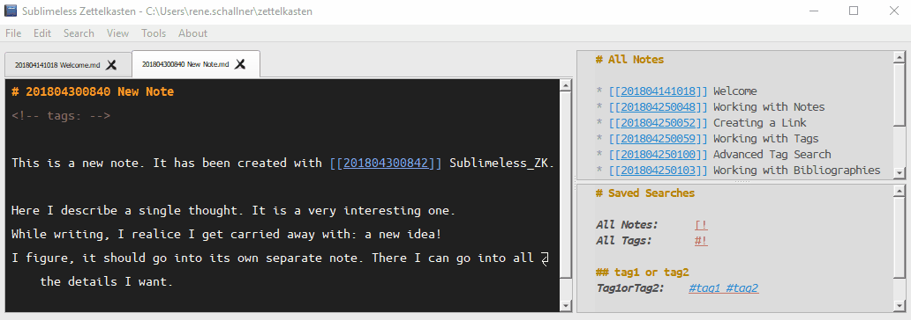


### Creating a link
Let's assume, you work in the note "201710282120 The rise of the machines":

```markdown
# The rise of the machines
tags = #AI #world-domination

Machines are becoming more and more intelligent and powerful.

This might reach a point where they might develop a consciensce of their own.
```

You figure, a link to the "AI is going to kill us all" note is a good fit to expand on that aspect of the whole machine-rise story, so you want to place a link in there.

You start typing:

```markdown
# The rise of the machines
tags = #AI #world-domination

Machines are becoming more and more intelligent and powerful.

This might reach a point where they might develop a consciensce of their own.

As a consequence, they might turn evil and try to kill us all ........... [[
```

The moment you type `[[`, a list pops up with all the notes in your archive. You enter "kill" to narrow down the selection list and select the target note. Voila! You have just placed a link into your note, which now looks like this:

```markdown
# The rise of the machines
tags = #AI #world-domination

Machines are becoming more and more intelligent and powerful.

This might reach a point where they might develop a consciensce of their own.

As a consequence, they might turn evil and try to kill us all ........... [[201710282118]]
```

**Note:** Only files ending with the extension specified in the settings (`.md` by default) will be listed in the popup list. If your files end with `.txt`, you need to change this setting.

**Note:** With [this setting](#insert-links-with-or-without-titles) you can have the note's title inserted right after the link as well: `[[201710282118]] AI is going to kill us all`

If you now click into `[[201710282118]]`, the target note will be opened in a new tab where you can read up on how AI is potentially going to kill us all.

Here you can see what the list of notes to choose from looks like:

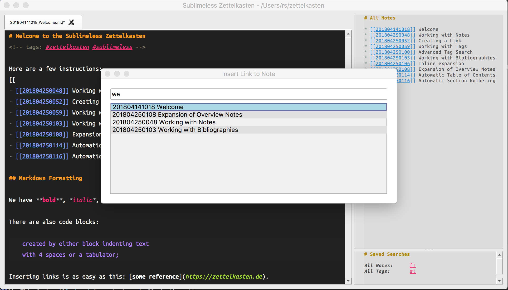

#### Implicitly creating a new note via a link
There is another way to create a new note: Just create a link containing its title and click it.

To showcase this, let's modify our example from above: Say, the "AI is going to kill us all" does **not** exist and you're in your "The rise of the machines" note.

This is what it might look like:

```markdown
# The rise of the machines
tags = #AI #world-domination

Machines are becoming more and more intelligent and powerful.

This might reach a point where they might develop a consciensce of their own.
```

You now want to branch into the new thought you just had, that AI might potentially eventually be going to kill us all. You prepare for that by mentioning it and inserting a link, like this:

```markdown
# The rise of the machines
tags = #AI #world-domination

Machines are becoming more and more intelligent and powerful.

This might reach a point where they might develop a consciensce of their own.

As a consequence, they might turn evil and try to kill us all ........... [[AI is going to kill us all]]
```

**Note:** You will have to press `[ESC]` after typing `[[` to get out of the note selection that pops up, before entering the note title.

**Note:** Of course this also works if you use a single quote link: `[AI is going to kill us all]`.

Now, in order to actually create the new note and its link, all you have to do is to click inside the new note's title, just as you would if you wanted to open a regular linked note.

And voila! A new note `201710282118 AI is going to kill us all.md` will be created and opened for you.

But the really cool thing is, that the link in the original note will be updated to the correct ID, so again you will end up with the following in the parent note:

```markdown
# The rise of the machines
tags = #AI #world-domination

Machines are becoming more and more intelligent and powerful.

This might reach a point where they might develop a consciensce of their own.

As a consequence, they might turn evil and try to kill us all ........... [[201710282118]]
```

**Note** how the note title "AI is going to kill us all" has been replaced by the note's ID "201710282118".

**Note:** With [this setting](#insert-links-with-or-without-titles) you can have the note's title inserted right after the link as well, like in : `[[201710282118]] AI is going to kill us all`

The new note will be pre-filled with the following text:

```markdown
# AI is going to kill us all
tags =
.
```

#### Supported link styles
When inserting links manually, you are can choose between the following supported link styles:

```markdown
## Wiki Style
[[201711111707]] Ordinary double-bracket wiki-style links

## Wiki Style with title
[[201711111708 here goes the note's title]] same with title

## Single-Pair
[201711111709] one pair of brackets is enough

## Single-Pair with title
[201711111709 one pair of brackets is enough]
.
```

This is how they are rendered:


### Searching for friends
If you see a link in a note and wonder what **other** notes also reference this note, then that is easy enough to do: Just hold down the <kbd>alt</kbd> key when clicking the link. Alternatively, place the cursor inside the link and press <kbd>alt</kbd>+<kbd>enter</kbd>.


### Listing all notes

The shortcut <kbd>[</kbd> + <kbd>!</kbd> produces a list of all notes in the search results.

### Browsing through notes

To quickly open a note, you can open the note browser with <kbd>ctrl/cmd</kbd> + <kbd>P</kbd>. This will let you fuzzy-search your notes and open the one you select.

### Find in files
<kbd>shift</kbd>+<kbd>ctrl/cmd</kbd>+<kbd>F</kbd> brings up a panel that lets you enter text you search for. On <kbd>enter</kbd>, the search results area will show links to notes containing your search-term.

### Working with tags

#### Getting an overview of all your tags
Over time you might collect quite a number of **#tags** assigned to your notes. Sometimes it helps to get an overview of all of them, maybe to check for synonyms before creating a tag, etc.

When you press `#!` (that is the `#` key followed by the `!` key) quickly, the search results will list all your #tags right next to your text:

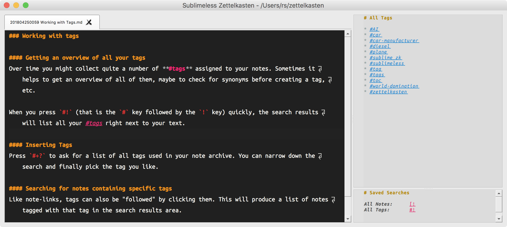


#### Inserting Tags
Press `#+?` to ask for a list of all tags used in your note archive. You can narrow down the search and finally pick the tag you like.


#### Searching for notes containing specific tags
Like note-links, tags can also be "followed" by clicking them. This will produce a list of notes tagged with that tag in the search results area.

#### Advanced Tag Search

To search for more sophisticated tag combinations, use the command `Search for Tag Combination` (<kbd>Control</kbd> + <kbd>T</kbd>) from the search menu.

It will prompt you for the tags you want to search for and understands quite a powerful syntax; let's walk through it:

##### Grammar and Syntax

```
search-spec: search-term [, search-term]*
search-term: tag-spec [ tag-spec]*
tag-spec: [!]#tag-name[*]
tag-name: {any valid tag string}
```

**What does that mean?**

* _search-spec_ consist of one or more _search-terms_ that are separated by comma
* each _search-term_ consists of one or more _tag-specs_
* each _tag-spec_
    * can be:
        * `#tag  ` : matches notes tagged with `#tag`
        * `!#tag ` : matches all results that are **not** tagged with `#tag`
    * and optionally be followed by an `*` asterisk to change the meaning of `#tag`
        * from *exact* `#tag`
        * to tags *starting with* `#tag`

**How does this work?**

* Each search is performed in the order the *search-terms* are specified.
    * With each *search-term* the results can be narrowed down.
    * This is equivalent to a logical _AND_ operation
    * Example: `#car, #diesel` will first search for `#car` and then narrow all `#car` matches down to those also containing `#diesel`.
        * This is equivalent to `#car` _AND_ `#diesel`.
* Each *tag-spec* in a *search-term* adds to the results of that *search-term*.
    * This is equivalent to a logical _OR_ operation.
    * Example: `#car #plane` will match everything tagged with `#car` and also everything tagged with `#plane`
        * This is equivalent to `#car` _OR_ `#plane`.
* Each *tag-spec* can contain an `*` asterisk placeholder to make `#tag*` stand for *all tags starting with `#tag`*
    * This works for `#tag*` and `!#tag*`.
    * Examples:
        * `#car*` : will match everything that contains tags starting with `#car`, such as: `#car`, `#car-manufacturer`, etc.
        * `!#car*` : will match all results that do **not** contain tags starting with `#car`:
            * `#plane #car-manufacturer` will be thrown away
            * `#submarine` will be kept

##### Putting it all together

Examples:

`#transport !#car` : all notes with transport **+** all notes not containing car (such as `#plane`)

There is no comma. Hence, two search terms will be evaluated and the results of all of them will be combined (_OR_).

`#transport, !#car`: all notes with transport **-** all notes containing car

Here, there is a comma. So first all notes tagged with `#transport` will be searched and of those only the ones that are not tagged with `#car` will be kept (_AND_).

Pretty powerful.

`#transport #car, !#plane` : `#transport` or `#car` but never `#plane`

`#transport #car !#plane` : `#transport` or `#car` or anything else that's not `#plane`

I omitted examples using the `*` placeholder, it should be pretty obvious.

The following screen-shots illustrate the advanced tag search in action:

* the first one shows the results for `##AI`:
    * two notes match
    * one of them is tagged with `##AI #world-domination`
* the first one shows the results for `##AI, !#world*`:
    * only one note matches
    * it is tagged with `##AI`
    * the note from before is also tagged with `#world-domination` which gets eliminated by `, !#world*`.

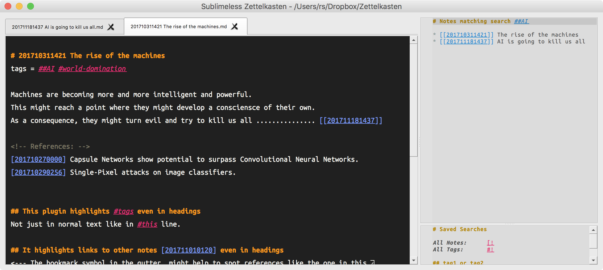

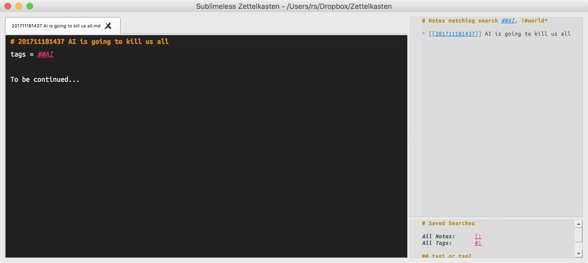

### Expansion of overview notes with selective refresh

#### Expansion of overview notes

Let's say you have an overview note about a topic that links to specifics of that topic that looks like this:

```markdown
O - Text production

This is an **overview note** about text production with the Zettelkasten method.

A few general words about our tool: Sublime ZK
[[201711111707]] Sublime ZK is awesome
[[201711111708]] Sublime ZK is great

Then we go more in-depth:
[[201711111709]] The specifics of how we produce text with the plugin

Cool!
```

This overview is just a collection of note links with brief descriptions and a bit of additional text.

Now, if you wanted to turn this overview note into a text containing the contents of the linked notes instead of just the links, then you can *expand* the note like this:

* Use the Tools menu: Tools > Expand Overview Note
* <kbd>Control</kbd> + <kbd>E</kbd>

You will be asked for the name of your new overview note et voila! Depending on your linked notes, the overview note will be expanded into a new note, maybe looking like this:


As you can see, the lines containing note links are replaced by the contents of their corresponding notes, enclosed in comment lines. You can now edit and save this file to your liking.


**Note**: If you want to refresh this expanded overview [(see below)](#refreshing-an-expanded-overview-note) later, then please leave those comments in!

**Note:**: If you modify the text of a linked note (between comment lines), then remove the extra `!` to prevent your change to get overwritten when [refreshing](#refreshing-an-expanded-overview-note) this overview.


#### Refreshing an expanded overview note

It might happen that you change some notes that are already expanded into your new expanded overview note. If that happens and you have left the comments in, then you can refresh the expanded overview:

* Use the Tools menu: Tools > Refresh expanded Note
* <kbd>Control</kbd> + <kbd>R</kbd>

**Note:** Only notes with comments starting with `<!-- !` will be considered for a refresh.

**Tip:** That means: To keep your edits of specific expanded notes from being overwritten by a refresh, just delete the extra `!`, making the comment start with `<!-- `. Alternatively, you can, of course, delete the comment lines for parts you are sure will never need refreshing.

The following animation illustrates expansion and refreshing:

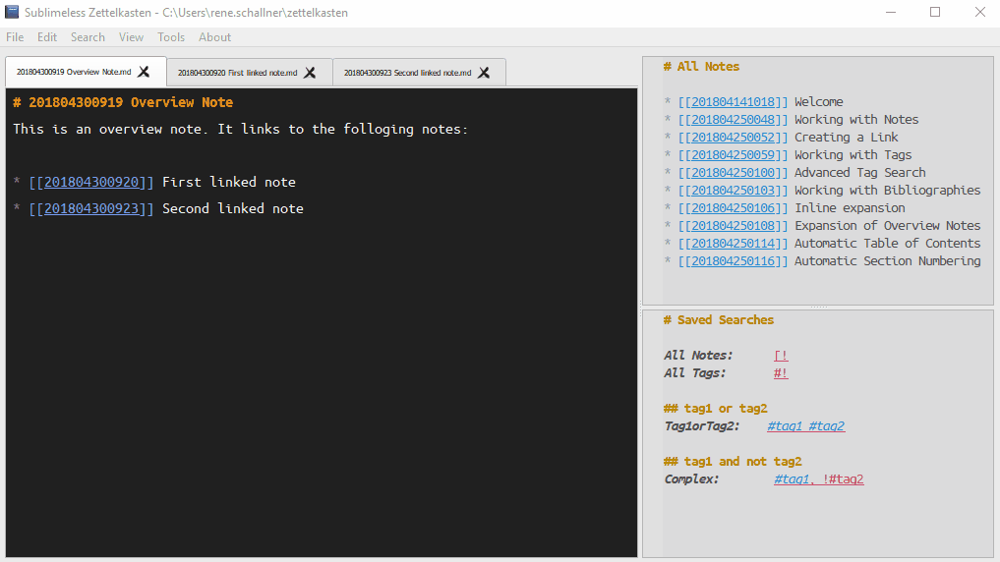

### Inline expansion of note-links

Overview note expansion is cool, but there are situations where you might not want to expand all links of a note but just a few. Also, since expansion does not descend into links of expanded notes, you might want to manually expand those.

Manually expanding a note link is easy: You must have your cursor in a note link, obiously. The key combination `[ctrl]+[.]` or `Expand Link inline` from the edit menu will then trigger the expansion. In contrast to the expansion method for overview notes in the previous section, the line containing the link will be preserved.

Here is an example using the already well-known AI notes: Let's start with our first note:

```markdown
# The rise of the machines
tags = #AI #world-domination

Machines are becoming more and more intelligent and powerful.

This might reach a point where they might develop a consciensce of their own.

As a consequence, they might turn evil and try to kill us all ........... [[201710282118]]
```

Now if you put your cursor inside the `[[201710282118]]` link and press `[ctrl]+[.]`, the text will change into this:

```markdown
# The rise of the machines
tags = #AI #world-domination

Machines are becoming more and more intelligent and powerful.

This might reach a point where they might develop a consciensce of their own.

As a consequence, they might turn evil and try to kill us all ........... [[201710282118]]

<!-- !    [[201710282118]] AI is going to kill us all    -->
# AI is going to kill us all
tags =

<!-- (End of note 201710282118) -->
```

*(We've never actually written anything into the linked note. Usually there would be lots of text)*

**Note:** To remember `[ctrl]+[.]`: I wanted to use `...` as shortcut for expansion but it didn't work out :smile:

**Hint:** If, after expansion, you don't like what you see, just undo! :smile:

**Note:** Use this at your own risk when **ever** planning on refreshing an overview note. You are going to have nested expansions and precisely those will get overwritten when the parent note is refreshed.

### Inline expansion of #tags
Another workflow for producing overview notes is by #tag. So if you want to produce an overview note referencing all notes tagged by a single tag, just press `[ctrl]+[.]` while the cursor is inside a #tag. This will produce a **bulleted list** of notes tagged with the #tag.

The following animation shows inline expansion of #tags in action:

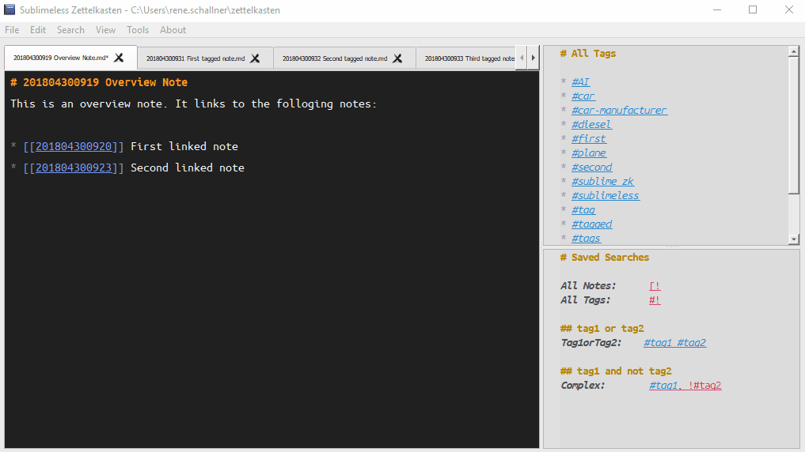

### Inline expansion of citekeys
In order to produce an outline of all notes citing a specific source, just press `[ctrl]+[.]` while the cursor is inside a *citekey*. This will produce a **bulleted list** of notes containing a reference to the *citekey*.

**Note:** This works with `@pandoc` and `#multimarkdown` style citation keys and is independent of whether the citekey is part of an actual citation (`[@citekey]` or `[][#citekey]`) or just occurs in your text as `@citekey` or `#citekey`.

The following animation shows inline expansion of citekeys in action:

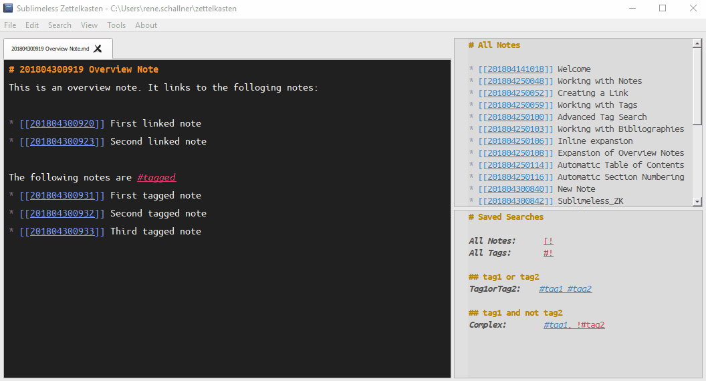


### Working with Bibliographies

#### Inserting a citation
If your note archive contains one or you [configured](#location-of-your-bib-file) a `.bib` file, then you can use the shortcut `[@` or `[#` to insert a citation. Which one you use depends on your preferences, whether your prefer pandoc or multimarkdown.

A fuzzy-searchable list of all entries in your bibfile will pop up, containing authors, year, title, and citekey. To select the entry you like, just press `[enter]`. To exit without selecting anything, press `[esc]`.

When you made your choice, a citation link will be inserted into the text: `[@citekey]` (or `[][#citekey]` if you [use MultiMarkdown style](#citation-reference-style)).

The following animation shows this in action:


**Note** 

* Your `.bib` file is loaded the first time you insert a citation
* Strings in the `.bib` file are being converted to unicode so umlauts and special characters can be displayed in the fuzzy panel
* This conversion can take long
* To disable the conversion and live with `u` instead of `ü`, set the setting `"convert_bibtex_to_unicode"` to `false`.
* To re-load your `.bib` file, use the menu Tools > Reload BIB file or press <kbd>ctrl/cmd</kbd> + <kbd>shift</kbd> + <kbd>B</kbd>

#### Automatic Bibliographies
It is common practice to keep local bibliographies in your notes. This makes each note self-contained and independent of `.bib` files. Manually maintaining a list of all your cited sources can be tedious and error-prone, especially in the case of long notes with many citations. Provided a `.bib` file is part of your note archive or you have [configured](#location-of-your-bib-file) one, then this app can take care of all your citations for you.

**Note:** This will only work if you have `pandoc` and its companion `pandoc-citeproc` installed in a location that is referenced by your `PATH` environment variable! See the [how to install pandoc](https://pandoc.org/installing.html), it's a breeze.

In any note with citations

* pick `Insert Bibliography` from the edit menu
* press <kbd>Control</kbd> + <kbd>B</kbd>

This will add a long comment to your note in the following format *(line wrapping added for github manually)*:

```markdown
<!-- references (auto)

[@AhrensHowTakeSmart2017]: Ahrens, Sönke. 2017. _How to Take Smart Notes: One Simple Technique
to Boost Writing, Learning and Thinking for Students, Academics and Nonfiction Book Writers_. 1st ed.
CreateSpace Independent Publishing Platform.

[@FastZettelkastenmethodeKontrollieredein2015]: Fast, Sascha, and Christian Tietze. 2015.
_Die Zettelkastenmethode: Kontrolliere dein Wissen_. CreateSpace Independent Publishing Platform.

-->
```

The animation below shows how handy this is :smile:

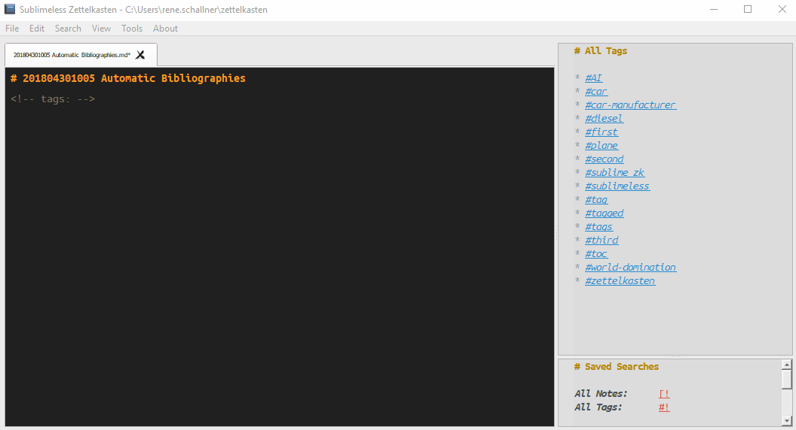

**Note:** You don't have to cite in the `[@pandoc]` notation. If a cite-key is in your text, it will get picked up. However, the generated references section will use the `[@pandoc]` notation, except if you set [change the setting](#citation-reference-style) `citations-mmd-style` to `true`, then the `[#citekey]: ...` MultiMarkdown notation will be used.

**WARNING**: Do not write below the generated bibliography. Everything after `<!-- references (auto)` will be replaced when you re-run the command!

#### Searching for notes referencing a specific citekey

In order to be able to search for all notes citing the same source, just like note-links and #tags, **citation keys** can also be "followed" by clicking them.

**Note:** This works with `@pandoc` and `#multimarkdown` style citation keys and is independent of whether the citekey is part of an actual citation (`[@citekey]` or `[][#citekey]`) or just occurs in your text as `@citekey` or `#citekey`.


### Section Numbering and Table Of Contents

This app lets you pep up your texts with automatically numbered sections and tables of content.

#### Automatic Table Of Contents
Some notes can get quite long, especially when turning overview notes into growing documents. At some stage it might make sense to introduce a table of contents into the text. This can be useful when using some Markdown Preview app to quickly check your text in a browser.

To insert a table of contents at your current cursor position:

* from the edit menu select `Insert Table of Contents`
* press <kbd>Control</kbd> + <kbd>Shift</kbd> + <kbd>T</kbd>

The table of contents will be placed between two automatically generated comments that also serve as markers for the app. It will consist of a bulleted list consisting of links to the headings in your text. The links are only relevant when converting your text into HTML.

Why a bulleted list and not a numbered one? You might have numbered the sections yourself. Numbered lists would get in the way in that case. Also, numbered lists produce `ii.` instead of `1.2` when nesting them.

Example before TOC:

```markdown
# 201711250024 Working with tocs
tags = #sublime_zk #toc


## This is a very long note!
At least we pretend so.

## It contains many headings
That's why we are going to need a table of contents.

### **with funny chäråcters!**
Funny characters can be a challenge in the `(#references)`.

## as can duplicate headings

# as can duplicate headings
.
```

Example after TOC:

```markdown
# 201711250024 Working with tocs
tags = #sublime_zk #toc

<!-- table of contents (auto) -->
* [201711250024 Working with tocs](#201711250024-working-with-tocs)
    * [This is a very long note!](#this-is-a-very-long-note)
    * [It contains many headings](#it-contains-many-headings)
        * [**with funny chäråcters!**](#with-funny-characters)
    * [as can duplicate headings](#as-can-duplicate-headings)
* [as can duplicate headings](#as-can-duplicate-headings_1)
<!-- (end of auto-toc) -->

## This is a very long note!
At least we pretend so.

## It contains many headings
That's why we are going to need a table of contents.

### **with funny chäråcters!**
Funny characters can be a challenge in the `(#references)`.

## as can duplicate headings

# as can duplicate headings
.
```

**Note:** Whenever you need to refresh the table of contents, just repeat the above command.

**Note:** You can configure the separator used to append a numerical suffix for making references to duplicate headers distinct: by changing the `toc_suffix_separator` in the settings. It is set to an underscore by default (*markdown preview*, parsers based on Python's *markdown* module). If you use [pandoc](https://pandoc.org/), you should set it to `-`.

The following animation shows TOC insertion and refreshing in action:

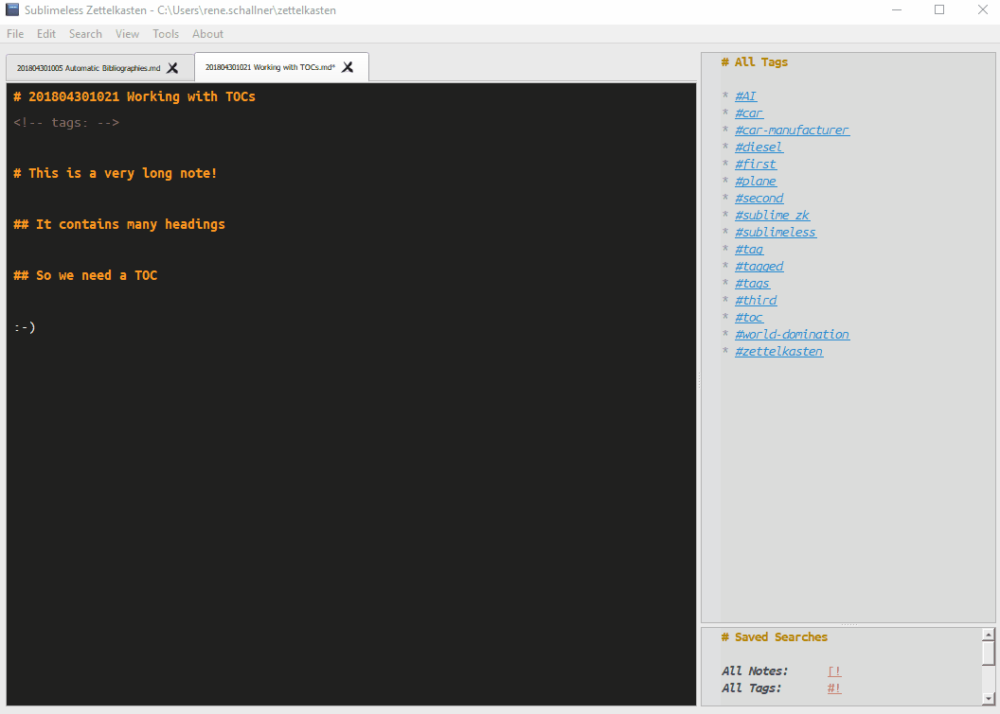


#### Automatic Section Numbering

Especially when your text is large enough for needing a table of contents, it is a good idea to number your sections. This can be done automatically as follows:

* from the edit menu select `Insert Section Numbers`
* press <kbd>Control</kbd> + <kbd>Shift</kbd> + <kbd>N</kbd>

Automatically inserted section numbers will look like in the following note:

```markdown
# 1  201711250024 Working with tocs
tags = #sublime_zk #toc


## 1.1  This is a very long note!
At least we pretend so.

## 1.2  It contains many headings
That's why we are going to need a table of contents.

### 1.2.1  **with funny chäråcters!**
Funny characters can be a challenge in the `(#references)`.

## 1.3  as can duplicate headers

# 2  as can duplicate headers
.
```

**Note:** 

* You can refresh the section numbers at any time by repeating the above command.
* To switch off numbered sections, use the command `Remove Section Numbers` from the edit menu.
* The setting `"skip_first_heading_when_numbering": true` will skip the first heading of your note and not assign it a number. This can be useful if your first heading is the note title.

The animation below shows both section (re-)numbering and auto-TOC:

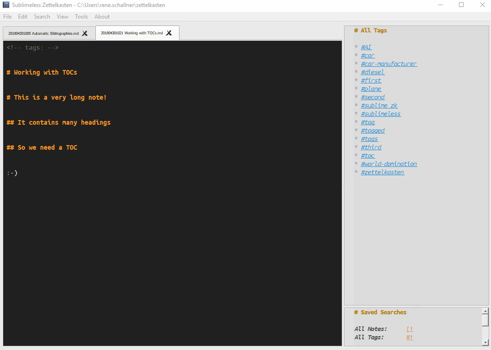

## Saved Searches

The bottom right editor shows a saved searches file. This is a simple Text file where you can name and store search terms.

**Note:** This file is saved automatically each time a note is saved. If you manually want to save it, just press <kbd>ctrl/cmd</kbd>+<kbd>S</kbd> while the text cursor is in the saved searches editor.

The syntax is very simple; to define a search, you just add a line, consisting of the following parts:

* an optional search name
* a colon `:`, followed by either
    * a search-spec (see [advanced tag search](#advanced-tag-search) for more information)
        * `#!` (all tags) and `[!` (all notes) are also valid search-specs
    * or, instead of a tag search, any search term you want to search for in *find_in_files* fashion.

The `search-spec` will be highlighted in the file, so you know exactly what will be searched for.

You can place Markdown headings anywhere in the file, too, like this:

```markdown
# Shortcuts
All Notes    :    [!
All Tags     :    #!

# Tag Searches
just one  tag:          #tag
tag1 or  tag2:          #tag1  #tag2
tag1 and tag2:          #tag1, #tag2

# A bit more complex
tag1 but not tag2:                 #tag1, !#tag2
tag1 or anything that's not tag2 : #tag1 !#tag2

# Wildcard searches
anything starting with auto : #auto*
anything starting with auto but nothing starting with plane: #auto*, !#plane*
```

You can execute the search by clicking on the underlined search spec.

## HTML Export


You can export your note archive, or parts thereof, into a semantic text view, consisting of one big HTML file and optional images:

* In the file menu, choose "Export archive to HTML..."
* Click on the "..." button to select a destination folder
* Optionally add a base URL if you plan to upload to a web server later (to get the links to images right)
    * e.g. `https://my.server.com/folder`
    * do this only if you **really** want to upload to a server.
    * For checking the generated HTML locally, leave that field blank
* Optionally specify start and end date ranges
    * e.g. `2018`, or `20180429`
* Optionally specify tags notes must be tagged with
* Optionally specify tags notes must not be tagged with
* Choose one of the [available parsers](#about-the-available-parsers)
* Click "Convert!"

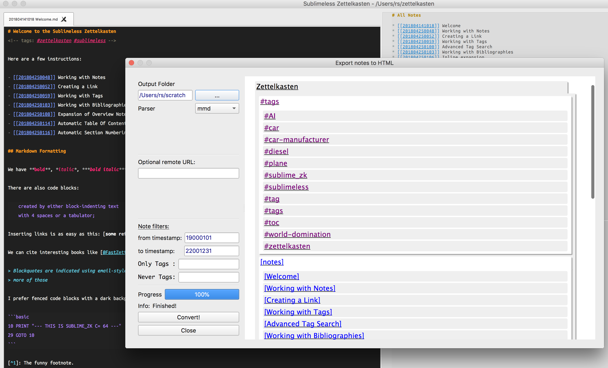


The resulting semantic text view features:

* Browsing
    * Notes by title
    * tags: see what notes are tagged with a certain #tag
    * cite keys: see what notes cite a specific source

* Notes
    * show your notes
    * show clickable #tags the note contains
    * show links to expand into linked notes, for each paragraph that contains links.
    * show links to cite keys that expand into the citation's source and also a list of links to notes that also cite that source
    * show fenced code blocks with syntax-coloring
    * show local images, automatically scaled 
    
* tags
    * Are displayed in the #tags overview but also inside each note
    * Clicking on a #tag expands it into a list of tagged notes

* cite keys
    * Are displayed in the @citations overview but also after each paragraph that contains citations.
    * Clicking on a cite key shows the citation's source and also a list of links to notes that also cite that source

Here is what it looks like when clicking on a demo note:

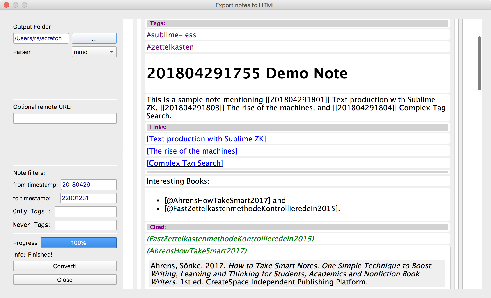

On Linux, unfortunately there is no HTML preview, but an "open in browser" button:

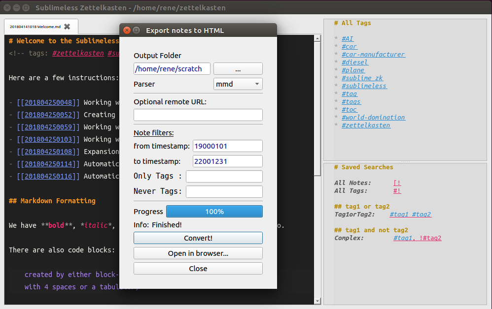

### About the available parsers

There are 3 different markdown parsers available:

* basic: the fastest but least capable parser
    * handles pandoc and multimarkdown citations
    * handles pandoc and multimarkdown style fenced code blocks with syntax coloring
    * no tables
    * supports images
* multimarkdown (default): fast parser, should always be used
    * handles pandoc and multimarkdown citations
    * handles pandoc and multimarkdown style fenced code blocks with syntax coloring
    * handles multimarkdown tables
    * supports images
* pandoc: slow parser but can handle pandoc markdown
    * handles pandoc and multimarkdown citations
    * handles pandoc and multimarkdown style fenced code blocks with syntax coloring
    * handles multimarkdown tables
    * **handles pandoc tables**
    * supports images

You should always use the default mmd parser, even if your text uses pandoc syntax.

The only exception is: If your text contains pandoc style tables, then go for the pandoc parser. Pandoc `[@citations]` and pandoc `~~~fenced cod blocks~~~` will be converted internally automatically by the tool, so that the multimarkdown parser can handle them.


## Customizing Themes

Themes are simple JSON files that define 

* the font
* styles
* colors

of the Markdown editor.

### Creating a new Theme 

To create a new theme, run View > Create new Theme ... from the menu. You will be prompted for a name and upon entering it:

* a copy of your currently active theme will be made your new theme
* a json editor opens where you can modify your new theme

When you File > Save (<kbd>ctrl/cmd</kbd> + <kbd>S</kbd>) the file, your new theme is ready. You can switch to it via View > Switch Theme. After switching, you need to restart Sublimeless_ZK to load the new theme.

### Editing Themes

When you create a new theme or when you run View > Edit current theme, a JSON editor opens so you can modify the theme.

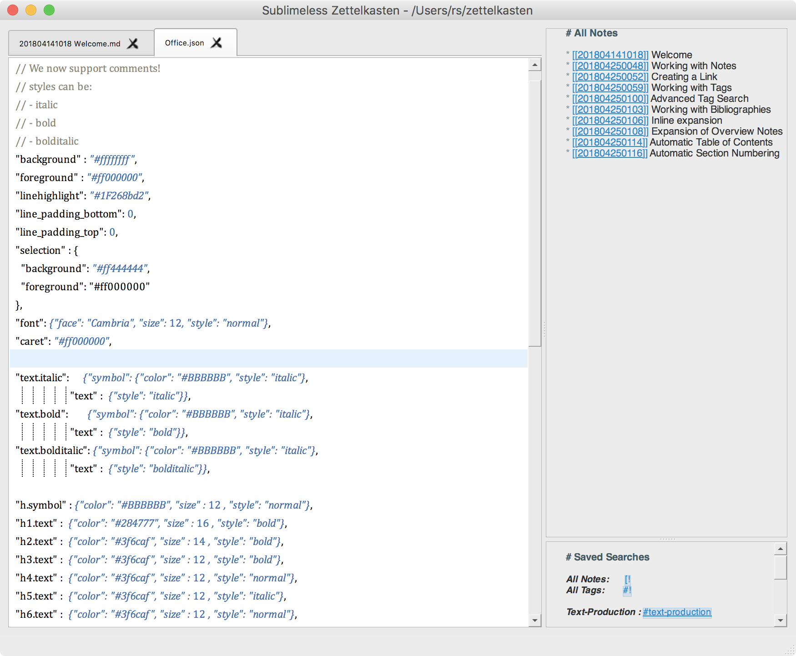

The following types are used in the description:

type | description
-----|------------
font | has 3 fields: "face" = name of the font, "size" = font-size, "style" = style of the font
pixels | a number of pixels
color | HTML color code
color with alpha | HTML color code with alpha prefix (1F in #1F333333)
style | one of "normal", "bold", "italic", and "bolditalic"
text-type | has a "color" field of type color, a "style" field of type style, and a "background" field of type color for the background color of the text
markup | has a "symbol" field of type text-type for the markup symbol (`#` for headings, `*` or `_` for italic, ...), and a "text" field for styling the marked-up text

The following fields define the appearance of the markdown editor:

key        | type   | description
-----------|--------|-------------
background | color  | background color
foreground | color  | default text color
linehighlight | color with alpha | color and alpha (1F in #1F333333) for highlighting the current line
line_padding_top | pixels | number of pixels to pad the top of lines with (extra line height)
line_padding_bottom | pixels | number of pixels to pad the bottom of lines with (extra line height)
selection | colors with alpha | "background" defines the background and foreground the text color of selected text
font      | font | "face" = name of the font, "size" = font-size, "style" = style of the font
caret     | color | color of the cursor
text.italic | markup | defines how `_italic_` text is displayed
text.bold | markup | defines how `**bold**` text is displayed
text.bolditalic | markup | defines how `***bolditalic***` text is displayed
h.symbol | text-type | defines how the markup symbol `#` is styled in headings
h1.text | text-type | defines how the text of `# h1 headings` is styled
h2.text | text-type | defines how the text of `## h2 headings` is styled
h3.text | text-type | defines how the text of `### h3 headings` is styled
h4.text | text-type | defines how the text of `#### h4 headings` is styled
h5.text | text-type | defines how the text of `##### h5 headings` is styled
h6.text | text-type | defines how the text of `###### h6 headings` is styled
quote | markup | defines how `> quotes` are styled
code.fenced | markup | defines how ` ```code blocks` are styled
code | markup | defines how  &nbsp; &nbsp; &nbsp; &nbsp; `indented code` and `` `inline code` `` is styled
list.symbol | text-type | the style of the `*`, `-`, and `1.` symbols in lists
list.unordered | text-type | the style of the text of unordered `*` or `-` lists
list.ordered | text-type | the style of the text of ordered `1.`, `2.`, ... lists
tag | text-type | the style of `#tags`
citekey | text-type | the style of `@citekeys` or `#citekeys` inside `[@citekey]` or `[][#citekey]` citations
link | text-types | has 3 fields "title", "url", and "attr" for styling `[title](url){optional-attributes}` links
zettel.link | text-type | style of `[[201804300800]]` note links 
comment | text-type | style of `<!-- comments -->`
footnote | text-type | style of `^text` inside a `[^footnote]` footnote

**Note:** On save, the editor will display an error message if your JSON contains errors. The error message will contain a short description including the line and column number of the first character where the error occured. The cursor will be set at exactly that position so you can figure out more easily what is incorrect. Syntax-coloring should also help you formatting the theme file.

### Switching Themes

View > Switch Theme ... will open a fuzzy-searchable list of all installed themes. When you select a theme, you will receive a message to restart Sublimeless_ZK for the new theme to take effect.

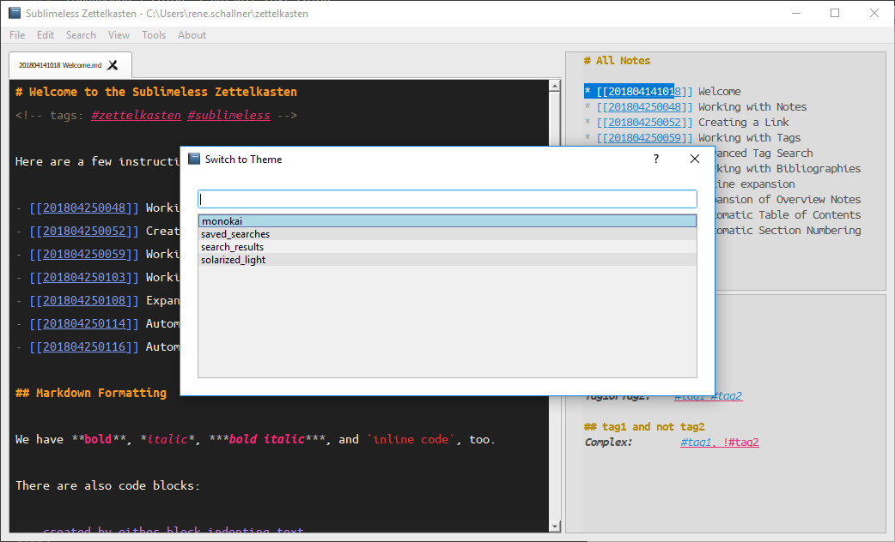


## Credits

Credits, where credits are due:

* Thanks to [Niklas Luhmann](https://en.wikipedia.org/wiki/Niklas_Luhmann) for coming up with this unique way of using a Zettelkasten.
* Thanks to the guys from [zettelkasten.de](https://zettelkasten.de) for their Zettelkasten related resources. There are not that many out there.

While we're at it, I highly recommend the following books; Google and Amazon are your friends:

* "Das Zettelkastenprinzip" / "How to take smart notes" [(more info here...)](http://takesmartnotes.com/#moreinfo) will blow your mind.
* "Die Zettelkastenmethode" (German only) from Sascha over at zettelkasten.de will also blow your mind and expand on the plain-text approach of using a digital Zettelkasten.


